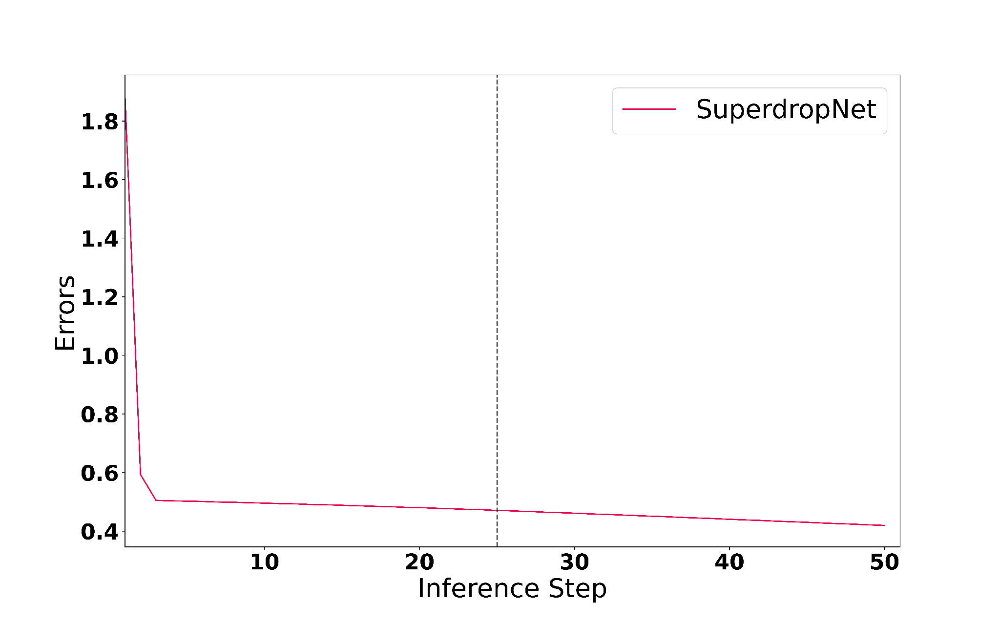

## Improving Representation of Cloud and Precipitation Processes

Processes related to cloud formation are heavily parameterized. These processes add to model uncertainity and inaccurate weather forecasts. These process also contribute to a large ensemble uncetainity in climate projections due to its effect on the radiative balance. We can leverage our understanding of these processes to train data-driven models, which act as a computatonaly cheaper proxy to partcile-based simulations. During my PhD, I developed SuperdropNet, trained on Lagrangian superdroplet simualtions of warm rain collisions. SUperdropNet is orders of magnitude faster than Lagrangian simulations and is one step closer to more realistic representation of cloud processes in the ICON weather model. 

## Physics-Informed Machine Learning

<small>*SuperdropNet is a dynamically stable emulator where the errors don't accumulate over time.*</small>

<small>*Image Title: Physics-Informed ML*</small>

Machine learning based approaches in Earth Science benefit from application of physical contraints based on conservation laws, prognostic approaches and stochastic modelling. To ensure stability of simulations and even enhance interpretability,  deep learning methods can be for nudged using our knwoledge of the physics of the problem at hand. SuperdropNet benefitted from autoregressive training, curriculum learning and impositio of mass conservation. Similarly, ML-based emulators for downscaling of climate data benefit from selective training on extreme values to learn a relistic distribution and weighting of the loss function. I am positive that any seemingly failed ML approach in Earth Science can instantly benefit from clever manipulation of statistics based on physics. 

## Hybrid Modelling

<small>*Image Title: Hybrid Modelling*</small>

I believe that AI has a lot to offer when it comes to representation of sub-grid scale processes in weather and climate models. It can fill in the gaps in numerical modelling, but there reain various componenets of numerical modelling that are extremely accuate and useful. Hence, it is imperative to continuously develop fast and convenient tools to couple AI compneents to largely FORTRAN based non-differentiable weather and climate models. Since my PhD, I have been working with experts at DKRZ to improve upon these tools, especially for ICON.  

## Regional Climate Modelling

<small>*Image Title: Regional Climate Modelling*</small>

Computationally expensive regional climate models offer great insight into local climate. However, they can be extremely expensive to run, especially for the Antarctic where customized parameterizations for snow processes operate on varyin temporal scales. Often, coarser global climate models struggle to capture these nuances. I am developing deep learning based emulators for downscaling climate data, with a special emphasis on improved approximation of precipitation events in the Antarctic under different SSP scenarios. 